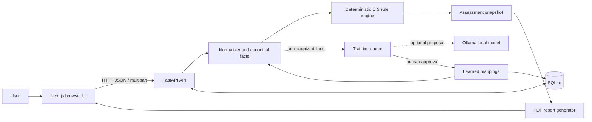

# NetAdaptAI — Architecture

## Purpose and scope

NetAdaptAI is a local prototype for assessing uploaded network-device configuration text. Its current native benchmark is the CIS Cisco IOS XE 17.x Benchmark v2.2.1 Level 1. It parses supported configuration facts, evaluates them with deterministic rules, exposes evidence and remediation, and exports a PDF report. Unsupported lines can enter a human-reviewed mapping workflow. Juniper support is limited to a built-in SSHv2 mapping demonstration; it is not a full Juniper benchmark.

## System overview

## Components

- **Frontend — `app/page.tsx`:** Next.js/React single-page dashboard. It uploads a file or pasted configuration, displays the current assessment and scoped training items, and provides workspace-wide overview, training, and knowledge-base views. It calls the backend over HTTP; the UI does not evaluate compliance itself. The API base defaults to `http://localhost:8000` and can be overridden with `NEXT_PUBLIC_API_URL`.
- **API — `backend/app/main.py`:** FastAPI routes for health, device snapshots, ingestion, training approval/denial, learned patterns, and PDF export. Ingestion reads UTF-8 text, builds an assessment, queues up to five previously unrecognized lines, and persists the snapshot when SQLite is available. The service currently manages one current device/configuration in process memory.
- **Normalization and evaluation — `engine.py`, `canonical.py`, `models.py`:** The normalizer maps recognized Cisco syntax and approved patterns into a typed canonical baseline with known fields and evidence. The rule engine compares those facts with 56 implemented CIS control definitions and returns PASS, FAIL, or UNKNOWN findings. Unknown facts remain UNKNOWN; the score is PASS findings divided by all findings. The rules, not the language model, determine compliance.
- **Mapping suggestions — `llm.py`:** Ollama is optional and proposes a canonical control/value for an unrecognized line from a restricted vocabulary. Invalid, unavailable, or timed-out proposals fall back to an unmapped heuristic result. An operator reviews and approves or denies each queued item. Approval saves a learned mapping, which can populate a canonical fact on later assessments and be reevaluated by the same deterministic rules.
- **Persistence — `database.py`:** SQLAlchemy with a local SQLite database at `backend/netadaptai.db`. It stores device assessment snapshots (baseline and findings), training items, and learned patterns, and performs additive migrations for older databases. Raw uploaded configuration text is held in backend memory for current-session reevaluation and is not written to SQLite. On restart, saved reports and mappings can be loaded, but a fresh upload is needed to re-evaluate the original raw configuration.
- **PDF export:** The API renders the current device’s findings, evidence, expected/actual values, remediation, and assessment metadata as a downloadable PDF using ReportLab.

## Typical data flow

1. The browser sends a configuration file or pasted text to `POST /api/ingest`.
2. The backend normalizes supported lines, applies approved learned mappings, and evaluates the resulting facts against the CIS rules.
3. The backend queues a limited number of unrecognized lines; Ollama may suggest mappings, while review and approval remain human actions.
4. The backend saves the assessment and queue state to SQLite when available, then returns the device snapshot to the UI.
5. The user reviews findings, downloads the PDF, or approves/denies a mapping. Approval persists the mapping and refreshes the current assessment when the source configuration remains in memory.

## Interfaces and operational boundaries

The frontend uses `GET /health`, `GET /api/devices`, `POST /api/ingest`, `GET /api/training`, `POST /api/training/{id}/approve`, `POST /api/training/{id}/deny`, `GET /api/patterns`, `DELETE /api/patterns/{id}`, and `GET /api/devices/{id}/report`. The frontend normally runs on port 3000 and the API on port 8000; CORS currently allows `http://localhost:3000`. SQLite is local; Ollama defaults to `http://localhost:11434` with model `llama3.2:3b` and may be configured using `OLLAMA_URL` and `OLLAMA_MODEL`.

This is a single-process local prototype: authentication/authorization, multi-user isolation, device polling, automatic remediation, complete multi-vendor benchmark coverage, and production deployment controls are not implemented. Assessment claims should be limited to the controls implemented in the current rule engine.
